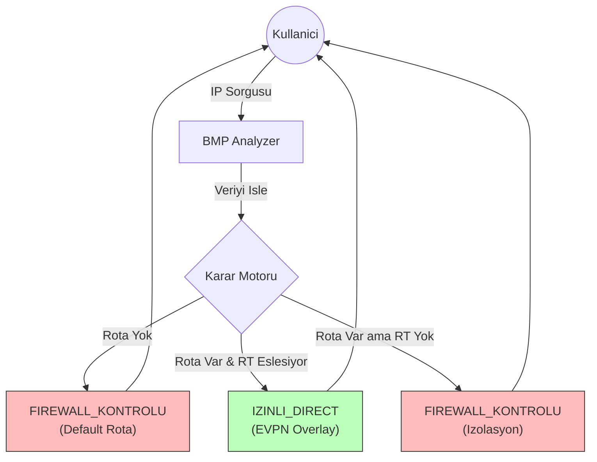

# 👁️ BMP Analyzer (BGP Monitoring Platform)

**BMP Analyzer**, Arista EVPN/VXLAN altyapıları için geliştirilmiş; ağ trafiğini analiz eden, izolasyon durumlarını doğrulayan ve olası rota sızıntılarını (Route Leak) tespit eden hafif bir **Gözlem (Observability)** aracıdır.

Karmaşık ticari yazılımlar yerine; **GoBGP** ve **Saf Python** gücüyle çalışır.


## 🚀 Ne İşe Yarar?

Ağ yöneticilerinin şu sorulara saniyeler içinde yanıt vermesini sağlar:
- *"Provider VRF'indeki Sunucu A, Secure VRF'indeki Sunucu B'ye erişebilir mi?"*
- *"Trafik doğrudan VXLAN üzerinden mi akıyor, yoksa Firewall'a mı yönleniyor?"*
- *"İzole olması gereken iki ağ arasında bir Route Leak (Sızıntı) var mı?"*

## 🧠 Çalışma Mantığı

Sistem, GoBGP'den aldığı ham veriyi 3 aşamalı bir analizden geçirir:



1. LPM (Longest Prefix Match): Girilen IP'nin hangi Subnet'e ait olduğunu bulur.
2. RD (Route Distinguisher) Analizi: O Subnet'in hangi VRF'te yaşadığını kesin olarak tespit eder.
3. RT (Route Target) Kontrolü: İki VRF arasında BGP seviyesinde konuşma izni olup olmadığını denetler.

## 🛠️ Kurulum
Bu araç Python Standard Library ile yazılmıştır. Harici bir pip install gerektirmez.

### GoBGP Kurulumu
GoBGP'yi sistemimize kurmak için karmaşık derleme işlemlerine gerek yok. GitHub üzerinden güncel versiyonu indirip çalıştırmamız yeterli.

### 1. Binary Dosyasını İndirme
Sunucunuza SSH ile bağlandıktan sonra en güncel sürümü çekelim (Burada mimarinize uygun olanı seçin, genelde amd64'tür):

```
# En guncel surumu indirin (Versiyon numarasini kontrol edebilirsiniz)
wget https://github.com/osrg/gobgp/releases/download/v3.18.0/gobgp_3.18.0_linux_amd64.tar.gz

# Arsivi acin
tar -xvf gobgp_3.18.0_linux_amd64.tar.gz

# Binary dosyalari sistemin calistirilabilir yoluna tasiyin
sudo mv gobgp /usr/local/bin/
sudo mv gobgpd /usr/local/bin/

# Kurulumu dogrulayin
gobgpd --version
# Cikti: gobgpd version 3.18.0
```

**gobgpd**: Arka planda çalışan BGP servisi (Daemon).
**gobgp**: CLI aracı (Komut satırından kontrol etmek için).

### Konfigürasyon Dosyasını Oluşturma
GoBGP'nin ayarlarını okuyacağı dizini ve dosyayı yaratalım:

```
sudo mkdir /etc/gobgp
sudo nano /etc/gobgp/gobgp.toml
```

*gobgp.toml dosyası configs altinda

Servisi aktif edip başlatalım:

```
sudo systemctl daemon-reload
sudo systemctl enable gobgpd
sudo systemctl start gobgpd
```

# Durumu kontrol et
sudo systemctl status gobgpd


### 1. Klonlayın
```
git clone https://github.com/onrmdc/bmp-analyzer.git
cd bmp-analyzer
```
### 2. Veri Kaynaklarını Ayarlayın
Scriptin çalışması için GoBGP sunucunuzda aşağıdaki JSON dosyalarının sunuluyor olması gerekir (Script içindeki DATA_SOURCE_URL değişkenini düzenleyin):
```
gobgp_rib.json: GoBGP EVPN tablosu.
arista_vrf_rules.json: VRF Import/Export kuralları.
```
### 3. Servisi Başlatın
```
nohup python3 -u bmp_server.py &
```

## ⚙️ Konfigürasyon Örnekleri
### Arista Spine (BGP Ayarı)
Spine cihazının VRF bilgisini (Extended Community) GoBGP'ye göndermesi şarttır.

```
router bgp 65001
   neighbor 192.168.100.5 remote-as 65000
   neighbor 192.168.100.5 ebgp-multihop 3
   neighbor 192.168.100.5 send-community extended
```
### GoBGP (Rota Dışa Aktarma)
Rotaları analizöre beslemek için Cronjob ile şu komutu çalıştırın:

```
gobgp global rib -a evpn -j > /var/www/html/gobgp_rib.json
```


### VRF Import Export Leak Bilgilerini Alma
**vrf_parser.py** kodu dosyalar arasinda var. 
Bu kod; Leaf switch'e bağlanır, show run section vrf komutunu çalıştırır, çıktıyı Regex (Düzenli İfadeler) ile analiz eder ve bmp_server.py'nin anlayacağı JSON formatına dönüştürüp kaydeder.


## 🔍 Kullanım Örnekleri
Servis ayağa kalktıktan sonra basit bir curl isteği ile analiz yapabilirsiniz.

**Senaryo 1: İzinli Trafik**

```
curl "http://localhost:5000/query?src=10.116.252.10&dst=10.118.38.0/24"
```
Sonuç: IZINLI_DIRECT (Trafik Overlay üzerinden akar).

**Senaryo 2: İzolasyon (Firewall)**
```
curl "http://localhost:5000/query?src=10.116.252.10&dst=10.118.192.11"
```
Sonuç: FIREWALL_KONTROLU (Doğrudan rota yok, trafik Firewall'a gider).
