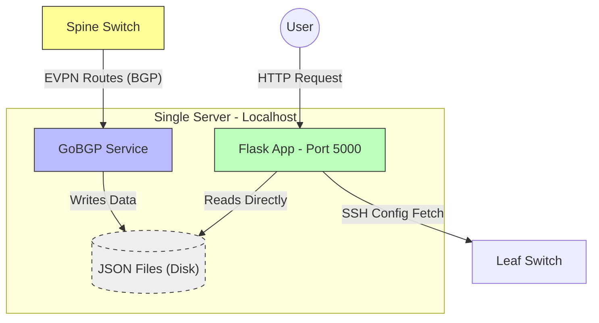

# 🕸️ BMP Analyzer

**BMP Analyzer** is a network automation and visualization tool designed to analyze routing logic and VRF isolation policies in real-time. It operates on a **Single-Node** architecture using GoBGP for the data plane and Flask for the control plane.

## 🏗️ Architecture

The system utilizes a "Direct I/O" approach where the Web Application reads routing data directly from the disk, eliminating the need for internal HTTP API calls.



🚀 Installation
1. Prerequisites
Ensure Python 3 and pip are installed.

```bash
sudo apt update && sudo apt install python3-pip -y
pip3 install -r requirements.txt
```

2. GoBGP Configuration
Copy the configuration file to the GoBGP directory.

```bash
cp configs/gobgpd.conf /etc/gobgp/gobgpd.conf
systemctl restart gobgp
```
3. Deploy Scripts & Service

```bash
# Create directory
mkdir -p /root/codes
```

# Copy scripts
```bash
cp scripts/* /root/codes/
chmod +x /root/codes/*.sh
```

# Enable Systemd Service
```bash
cp systemd/bmp-analyzer.service /etc/systemd/system/
systemctl daemon-reload
systemctl enable bmp-analyzer
systemctl start bmp-analyzer
```

✅ Usage
Health Check
Verify that BGP neighbor status is Established and the App is running.

```bash
/root/codes/check_health.sh
```
Web Interface
Open your browser and navigate to: http://<SERVER_IP>:5000

Enter Source IP (e.g., 10.116.252.11)
Enter Destination IP (e.g., 10.118.192.11)

Click Analyze.

The tool will display the routing path and visualize whether traffic is allowed or blocked by the Firewall due to VRF isolation.

⚙️ Configuration Details
GoBGP ASN: 4202202250

Router ID: 10.84.113.2

Peer IP: 10.32.113.201

Web Port: 5000


---

### 🚀 Commands to Push to GitHub

Once you have created these files locally, run these commands to push them to your repository:

```bash
git init
git add .
git commit -m "Initial commit - Single Node Direct I/O Architecture"
git branch -M main
git remote add origin https://github.com/onrmdc/bmp-analyzer.git
git push -u origin main
```
